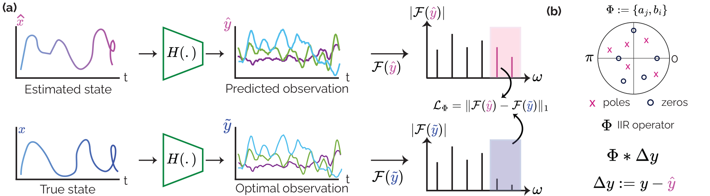

# FW-NKF: Frequency-Weighted Neural Kalman Filters

Official implementation of *"FW-NKF: Frequency-Weighted Neural Kalman Filters"*.



**Overview of FW-NKF with spectral supervision.** **(a)** The observation model *H(·)* predicts sensor measurements from both the ground-truth state **x** (supervised) and the estimated state **x̃**, guiding the model to reconstruct noise-free sensor signals and enabling frequency-selective denoising. **(b)** A learnable IIR filter Φ, parameterized by coefficients {*aⱼ*, *bⱼ*}, is applied causally to the innovation (the residual between observed **y** and predicted **ŷ**), selectively attenuating noise-dominated frequency bands before the Kalman update.

## Setup

```bash
git clone https://github.com/eth-siplab/Frequency-weighted-neural-Kalman-filters.git
cd Frequency-weighted-neural-Kalman-filters
pip install -r requirements.txt
```

Requires Python 3.10+ and PyTorch 2.0+ (CUDA recommended).

## Models

| Key | Model | Reference |
|-----|-------|-----------|
| `deep_kf` | **FW-NKF** (proposed) | This work |
| `knet` | KalmanNet | Revach et al., 2022 |
| `bayes_knet` | Bayesian KalmanNet | Revach et al., 2023 |
| `recursive_knet` | Recursive KalmanNet | Ghosh et al., 2024 |
| `recurrent_kalman_network` | Recurrent Kalman Network | Becker et al., 2019 |
| `autoreg_kf` | Autoregressive Kalman Filter | - |
| `classical_kf` | Classical Kalman Filter (learnable) | Kalman, 1960 |

## Datasets

| Key | Type | State dim | Obs dim | Description |
|-----|------|-----------|---------|-------------|
| `lorenz` | Synthetic | 3 | 2 | Lorenz attractor (chaotic system) |
| `pendulum` | Synthetic | 2 | 2 | Nonlinear pendulum dynamics |
| `uipdb` | Real | varies | varies | UWB-IMU human pose dataset |
| `euroc_tracking` | Real | 10 | 6 | EuRoC MAV IMU-based state estimation (10 sequences) |

Datasets are downloaded automatically on first use.

## Training

```bash
# Train FW-NKF on Lorenz with spectral loss
python trainer.py --model deep_kf --dataset lorenz \
  --epochs 30 --batch-size 128 --lr 1e-3 \
  --fft-weight 0.01 --seed 0 \
  --early-stop --early-restore-best --early-patience 10 \
  --save-dir ./checkpoints/deep_kf_lorenz_fft0.01_seed0
```

### Arguments

```bash
# Training
--lr 0.001                    # Learning rate
--weight-decay 0.0001         # Weight decay
--batch-size 32               # Batch size
--epochs 20                   # Number of epochs
--device cuda                 # Device (cuda/cpu)
--seed 42                     # Random seed
--fft-weight 0.0              # Spectral loss weight (lambda_Phi)
--grad-clip 1.0               # Gradient clipping

# WandB Logging
--wandb                       # Enable WandB
--wandb-project PROJECT       # WandB project name
--wandb-entity ENTITY         # WandB team/entity
--wandb-name RUN_NAME         # Custom run name
--wandb-tags tag1 tag2        # Tags for organization

# Model/Dataset Configuration
--model-args '{"hidden_dim": 512}'       # Model-specific args as JSON
--dataset-args '{"sequence_length": 100}' # Dataset-specific args as JSON

# Early Stopping
--early-stop                  # Enable early stopping
--early-patience 10           # Patience epochs
--early-restore-best          # Restore best weights

# Visualization
--viz-samples 3               # Number of samples to visualize
--viz-dims 2                  # Number of dimensions to plot
--viz-set val                 # Which set to visualize (val/test)

# Scheduler
--scheduler none              # LR scheduler (none/cosine/step/plateau)
--scheduler-args '{}'         # Scheduler args as JSON

# I/O
--save-dir ./checkpoints/latest   # Output directory
--save-every 0                    # Save every N epochs (0 = best only)
--val-ratio 0.1                   # Validation split ratio
--test-ratio 0.1                  # Test split ratio
```

## Evaluation

Test-set evaluation runs automatically at the end of each training run. Metrics (MSE, RMSE, MAE, NRMSE, R2) are saved to the checkpoint directory:

```
<save-dir>/
  <model>_<dataset>_test_metrics.json    # Test metrics
  <model>_<dataset>_val_metrics.json     # Validation metrics
  <model>_<dataset>_best/model.pt        # Best model checkpoint
  train_config.json                      # Full training configuration
  run_args.json                          # CLI arguments
  training.log                           # Training log
  viz/                                   # Trajectory plots (if --viz-samples > 0)
```

To aggregate results across seeds and hyperparameters:

```bash
python get_metrics.py --save-dir ./checkpoints/paper --split test --output results.csv

# Find best hyperparameters per (model, dataset, fft_weight)
python get_metrics.py --save-dir ./checkpoints/paper --best-configs
```

## Reproducing Paper Results

All paper experiments share the following base command. Vary `--model`, `--dataset`, `--fft-weight`, and `--seed` per row:

```bash
python trainer.py \
  --epochs 30 --batch-size 128 --lr 1e-3 --weight-decay 0 --scheduler none \
  --early-stop --early-restore-best --early-patience 10 \
  --val-ratio 0.1 --test-ratio 0.1 --viz-samples 2 \
  --model <MODEL> --dataset <DATASET> --fft-weight <LAMBDA> --seed <SEED> \
  --save-dir ./checkpoints/paper/<MODEL>_<DATASET>_fft<LAMBDA>_seed<SEED>
```

Mean +/- std over 3 seeds {0, 1, 2}.

### Results: Lorenz Attractor

[Download checkpoints](https://github.com/eth-siplab/Frequency-weighted-neural-Kalman-filters/releases/download/v1.0/lorenz.zip)

| Model | lambda | MSE | NRMSE | R2 | Reproduce |
|-------|--------|-----|-------|----|-----------|
| **FW-NKF (ours)** | **0.1** | **0.2755 +/- 0.0679** | **0.0318 +/- 0.0039** | **0.9990 +/- 0.0003** | `--model deep_kf --dataset lorenz --fft-weight 0.1` |
| KalmanNet | 0.01 | 19.5311 +/- 6.7329 | 0.2668 +/- 0.0500 | 0.9263 +/- 0.0255 | `--model kalman_net --dataset lorenz --fft-weight 0.01` |
| Classical KF | 0.01 | 255.7328 +/- 2.5091 | 0.9806 +/- 0.0034 | 0.0383 +/- 0.0066 | `--model classical_kf --dataset lorenz --fft-weight 0.01` |
| Bayesian KNet | 0.1 | 7.9957 +/- 2.7247 | 0.1705 +/- 0.0317 | 0.9699 +/- 0.0101 | `--model bayes_knet --dataset lorenz --fft-weight 0.1` |
| AutoReg KF | 0.0 | 225.5575 +/- 37.2090 | 0.9139 +/- 0.0775 | 0.1589 +/- 0.1374 | `--model autoreg_kf --dataset lorenz --fft-weight 0` |
| RKN | 0.0 | 2.1589 +/- 0.2444 | 0.0898 +/- 0.0054 | 0.9919 +/- 0.0010 | `--model recurrent_kalman_network --dataset lorenz --fft-weight 0` |
| Recursive KNet | 0.01 | 8.3259 +/- 2.8619 | 0.1741 +/- 0.0306 | 0.9688 +/- 0.0108 | `--model recursive_knet --dataset lorenz --fft-weight 0.01` |

### Results: Pendulum

[Download checkpoints](https://github.com/eth-siplab/Frequency-weighted-neural-Kalman-filters/releases/download/v1.0/pendulum.zip)

| Model | lambda | MSE | NRMSE | R2 | Reproduce |
|-------|--------|-----|-------|----|-----------|
| **FW-NKF (ours)** | **0.01** | **0.2777 +/- 0.0320** | **0.2297 +/- 0.0121** | **0.9471 +/- 0.0055** | `--model deep_kf --dataset pendulum --fft-weight 0.01` |
| KalmanNet | 0.1 | 0.7667 +/- 0.1964 | 0.3878 +/- 0.0455 | 0.8475 +/- 0.0364 | `--model kalman_net --dataset pendulum --fft-weight 0.1` |
| Classical KF | 0.01 | 3.4007 +/- 0.5353 | 0.8066 +/- 0.0601 | 0.3457 +/- 0.0986 | `--model classical_kf --dataset pendulum --fft-weight 0.01` |
| Bayesian KNet | 0.01 | 2.4510 +/- 0.2141 | 0.7126 +/- 0.0387 | 0.4907 +/- 0.0557 | `--model bayes_knet --dataset pendulum --fft-weight 0.01` |
| AutoReg KF | 0.0 | 3.8660 +/- 0.1373 | 0.8474 +/- 0.0411 | 0.2802 +/- 0.0685 | `--model autoreg_kf --dataset pendulum --fft-weight 0` |
| RKN | 0.01 | 0.6030 +/- 0.1242 | 0.3352 +/- 0.0314 | 0.8867 +/- 0.0212 | `--model recurrent_kalman_network --dataset pendulum --fft-weight 0.01` |
| Recursive KNet | 0.1 | 0.4551 +/- 0.1157 | 0.2909 +/- 0.0355 | 0.9141 +/- 0.0212 | `--model recursive_knet --dataset pendulum --fft-weight 0.1` |

### Results: EuRoC MAV

[Download checkpoints](https://github.com/eth-siplab/Frequency-weighted-neural-Kalman-filters/releases/download/v1.0/euroc.zip)

6 models × 3 FFT weights × 3 seeds = 54 runs. Recursive KNet excluded (OOMs at >47 GB even at batch=16 with truncated BPTT).

| Model | lambda | MSE | NRMSE | R2 | Reproduce |
|-------|--------|-----|-------|----|-----------|
| **FW-NKF (ours)** | **0.01** | **0.0352 +/- 0.0035** | **0.1057 +/- 0.0030** | **0.9888 +/- 0.0006** | `--model deep_kf --dataset euroc_tracking --fft-weight 0.01` |
| KalmanNet | 0.0 | 1.8103 +/- 0.2350 | 0.7544 +/- 0.0582 | 0.4275 +/- 0.0900 | `--model kalman_net --dataset euroc_tracking --fft-weight 0` |
| Classical KF | 0.01 | 2.1315 +/- 0.0000 | 0.8652 +/- 0.0000 | 0.2515 +/- 0.0000 | `--model classical_kf --dataset euroc_tracking --fft-weight 0.01` |
| Bayesian KNet | 0.0 | 2.3567 +/- 0.3576 | 0.8575 +/- 0.0130 | 0.2646 +/- 0.0224 | `--model bayes_knet --dataset euroc_tracking --fft-weight 0` |
| AutoReg KF | 0.0 | 1.9781 +/- 0.5654 | 0.7815 +/- 0.0592 | 0.3858 +/- 0.0951 | `--model autoreg_kf --dataset euroc_tracking --fft-weight 0` |
| RKN | 0.0 | 2.2645 +/- 0.2864 | 0.8464 +/- 0.0097 | 0.2835 +/- 0.0163 | `--model recurrent_kalman_network --dataset euroc_tracking --fft-weight 0` |

## Runtime Benchmark

```bash
python benchmark_runtime.py --device cuda:0
```

Measures inference speed (ms/timestep) and parameter count for all models on a standardized input.

## Project Structure

```
.
├── trainer.py                  # Training, evaluation, and visualization
├── get_metrics.py              # Aggregate and compare results across runs
├── benchmark_runtime.py        # Inference speed benchmark
├── models/                     # Kalman filter implementations
│   ├── deep_kf.py              #   FW-NKF (proposed)
│   ├── kalman_net.py           #   KalmanNet
│   ├── bayesian_kalman_net.py  #   Bayesian KalmanNet
│   ├── recursive_kalman_net.py #   Recursive KalmanNet
│   ├── recurrent_kalman_networks.py  # RKN
│   ├── autoreg_kf.py           #   Autoregressive KF
│   └── classical_kf.py         #   Classical KF (learnable)
└── loader/                     # Dataset loaders
    ├── lorenz_dataset.py
    ├── pendulum_dataset.py
    ├── uwbimu_dataset.py
    └── euroc_dataset.py
```

## Citation

```bibtex
@inproceedings{dogan2026fwnkf,
  title     = {{FW-NKF}: Frequency-Weighted Neural Kalman Filters},
  author    = {Dogan, Adnan Harun and Demirel, Berken Utku and Holz, Christian},
  booktitle = {IEEE International Conference on Robotics and Automation (ICRA)},
  year      = {2026}
}
```

## License

MIT
